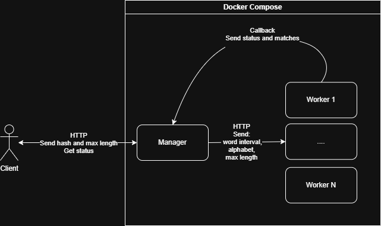

# CrackHash – Distributed MD5 Hash Cracking System

Распределённая система для взлома MD5-хэшей методом brute‑force перебора.

## Описание

Система CrackHash предназначена для взлома MD5 хэшей через перебор словаря, сгенерированного на основе алфавита.
Работает по следующей логике:

1. Клиент отправляет менеджеру MD5-хэш и максимальную длину искомого слова
2. Менеджер разбивает задачу на подзадачи и распределяет между воркерами
3. Воркеры выполняют перебор слов и возвращают найденные совпадения
4. Менеджер агрегирует ответы и предоставляет клиенту результат

## Архитектура



Система состоит из двух типов сервисов:

- **Manager** – принимает запросы от клиента, разбивает задачу на диапазоны индексов, распределяет подзадачи между воркерами, агрегирует результаты и предоставляет API для отслеживания статуса.
- **Worker** – регистрируется в менеджере, периодически отправляет heartbeat, получает диапазон индексов, генерирует слова, вычисляет MD5, отправляет прогресс и найденные слова.

**Ключевые особенности:**
- Плавное обновление прогресса (воркеры отчитываются каждые 100 000 итераций).
- При падении воркера его активные задачи переводятся в статус `ERROR`.
- Heartbeat‑мониторинг (воркеры шлют сигналы каждые 10 секунд, таймаут – 25 секунд).
- Итеративная генерация слов по индексу без хранения всех комбинаций в памяти.

## Инструкция по запуску

### Требования
- [Docker](https://docs.docker.com/get-docker/)

### Запуск

1. Клонируйте репозиторий:
    ```bash
    git clone https://github.com/arsbalchinov/CrackHash.git
    cd CrackHash
2. Запустите систему (по умолчанию 3 воркера):
    ```bash
    docker-compose build
    docker-compose up
3. Для запуска с другим количеством воркеров измените параметр replicas в файле docker-compose.yml
4. Остановка:
    ```bash
    docker-compose down

## API
1. Создание задачи на взлом хэша
#### `POST /api/hash/crack`
Создает задачу на подбор строки по MD5-хэшу.

Request body:

```json
{
  "hash": "cd79634dcddcc1ac584ef90b66c83d63",
  "maxLength": 5
}
```

Поля:

- `hash` - MD5-хэш в hex-формате, ровно 32 символа.
- `maxLength` - максимальная длина перебираемой строки, положительное целое число.
  
Response `200 OK`:

```json
{
  "requestId": "6c85c3f1-c9e2-487b-b555-4cb6c2179ca1"
}
```

2. Получение статуса выполнения
#### `GET /api/hash/status?requestId=<UUID>`

Возвращает статус ранее созданного запроса.

Пример запроса:

```bash
curl "http://localhost:8080/api/hash/status?requestId=6c85c3f1-c9e2-487b-b555-4cb6c2179ca1"
```
Response (IN_PROGRESS):

```json
{
  "status": "IN_PROGRESS",
  "progress": 65,
  "data": null
}
```

Response (READY):

```json
{
  "status": "READY",
  "progress": 100,
  "data": ["9z9z9"]
}
```

Response (ERROR):

```json
{
  "status": "ERROR",
  "progress": 45,
  "data": null
}
```
## Swagger документация

Swagger UI: http://localhost:8080/swagger
